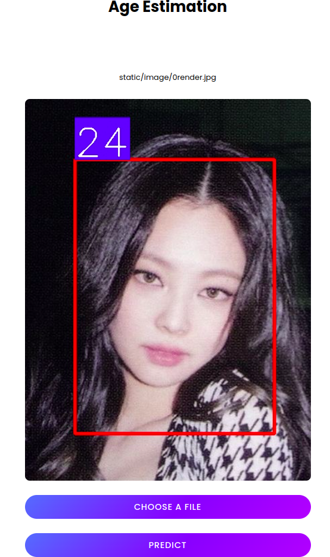

# Age estimation

This is a fork age prediction project from [nhshin-mcl/MWR]('https://github.com/nhshin-mcl/MWR').


## Run

Notebook: [Google Colab]('https://colab.research.google.com/drive/1Iq8CoaeHzKQpvvlWcT3ptJvlcFNSzYnR?usp=sharing')

Run demo: VGG ``app1.py``, MWR ``app2.py``
```bash
  python app1.py
```

```bash
  python app2.py
```
## Demo

A web demo is provided by [@datng-dev](https://github.com/datng-dev)




## Contributing

Contributions:
- We use random references instead of best pairs references since it's faster for testing (best pairs solution is really slow in the first run).
- We provide ``gen_triplet.py`` to create triplet, then train P-regressor using ``Train.py``.
- We also provide ``preprocessing.py`` to detect and crop face from original data

## Result

| Model      | MAE |
| ----------- | ----------- |
| MWR (random)      | 4.63       |
| VGG16   |  4.656        |

We re-train VGG that was trained on predicting p-rank for faster convergence.